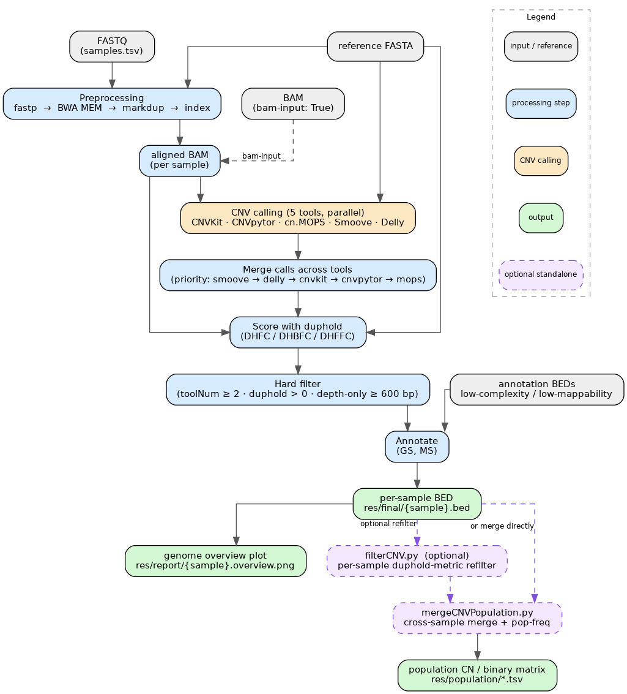
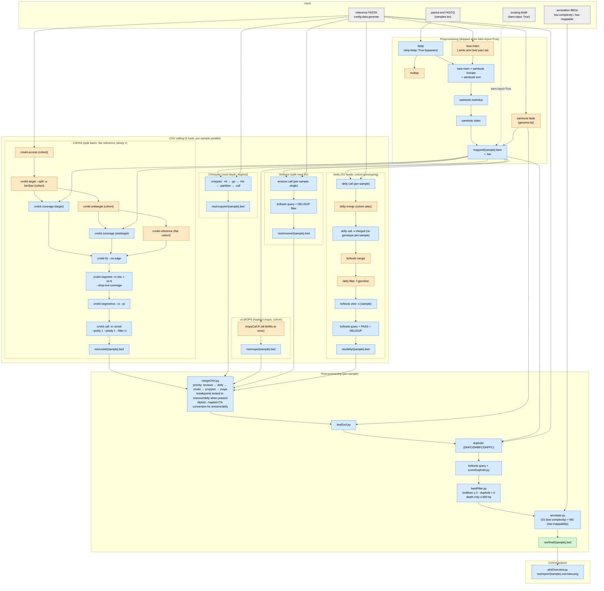

# FissionCNV

A Snakemake pipeline for CNV calling in haploid fission yeast (*Schizosaccharomyces*) populations. Adapted from [CNVPipe](https://github.com/sunjh22/CNVPipe).



## Workflow

1. **Preprocessing** (optional): fastp → BWA MEM → markdup
2. **CNV calling** with 5 tools in parallel:
   - [CNVKit](https://github.com/etal/cnvkit) — flat-reference mode, ploidy 1
   - [CNVpytor](https://github.com/abyzovlab/CNVpytor) — read-depth, ploidy 1
   - [cn.MOPS](http://bioconductor.org/packages/cn.mops/) — `haplocn.mops()`
   - [Smoove](https://github.com/brentp/smoove) — split-read SV
   - [Delly](https://github.com/dellytools/delly) — split-read + read-pair SV
3. **Merge** calls across tools (priority: smoove → delly → cnvkit → cnvpytor → mops)
4. **Score** with [duphold](https://github.com/brentp/duphold)
5. **Hard filter** (toolNum ≥ 2, duphold > 0, depth-only ≥ 600 bp)
6. **Annotate** with low-complexity (GS) and low-mappability (MS) overlap
7. **Output**: per-sample BED (`res/final/{sample}.bed`), per-sample genome overview plot

Cross-sample population merge is **not** part of the workflow (see below): different
species often need different per-sample refilter and overlap parameters before merging.

### Pipeline diagram



Legend: gray = inputs · orange = cohort-level (runs once across all samples) · blue = per-sample parallel · green = final outputs.

## Usage

```bash
# 1. Edit config.yaml: set genome, samples.tsv path, annotation BEDs, outdir
# 2. Edit samples.tsv: list sample names and fastq paths
# 3. Run
snakemake --profile profiles/default
```

The profile sets `--use-conda`, `--conda-prefix conda_envs`, `--latency-wait 60`, `-j 10`.

## Cross-sample population merge (standalone)

The workflow stops at per-sample `res/final/{sample}.bed`. Building the population
CN/binary matrices is a separate step so each species can use its own refilter and
overlap parameters. Two scripts, run after the workflow:

```bash
# 1. (optional) Refilter per-sample calls on duphold fold-change metrics.
#    DUP keeps metric > threshold; DEL keeps metric < threshold.
#    No threshold given for a type => that type passes through unchanged.
python scripts/filterCNV.py \
    --in-dir res/filtered --out-dir res/refilt_tier1 \
    --preset tier1                      # DUP all three >1.3, DEL all three <0.7

# fine-grained, e.g. constrain only the GC-corrected metric for DUPs:
python scripts/filterCNV.py \
    --in-dir res/filtered --out-dir res/refilt_dhbfc \
    --types dup --dup-dhbfc 1.5
# --mode all (default) requires every supplied threshold; --mode any needs one.
# Writes filter_log.tsv (parameters + per-sample kept counts) for reproducibility.

# 2. Cross-sample merge into population matrices.
python scripts/mergeCNVPopulation.py \
    --in-dir res/refilt_tier1 --out-dir res/population_tier1
# Overlap defaults match the old workflow (0.75 / 0.95 / 0.5, freq 0.8); override
# with --min-overlap/--max-overlap/--length-ratio/--freq-threshold.
```

Both read per-sample BEDs from `--in-dir` (default `res/filtered`), so you can merge
straight from hard-filtered calls or from a refiltered set. The merge is a greedy
front-to-back overlap merge, so region boundaries depend on input order; pass
`--samples` in a fixed order for reproducible boundaries across runs.

## Key config options

```yaml
data:
  samples: samples.tsv
  genome: /path/to/genome.fasta
  outdir: .                       # all output goes here
  low-complexity: /path/to/longdust.bed
  low-mappable: /path/to/genmap.bed

params:
  bam-input: False                # set True to skip preprocessing
  skip-fastp: False               # set True if input reads are pre-cleaned
  binSize: 200
  ploidy: 1
```

## Differences from CNVPipe

- Haploid: CN=0 (DEL), CN=1 (normal), CN≥2 (DUP). Smoove/Delly diploid CN is halved.
- No single-cell, no BAF filter, no ClassifyCNV, no GATK/freebayes, no autobin.
- Each species runs independently with its own reference and config.

## License

Inherits from upstream CNVPipe.
